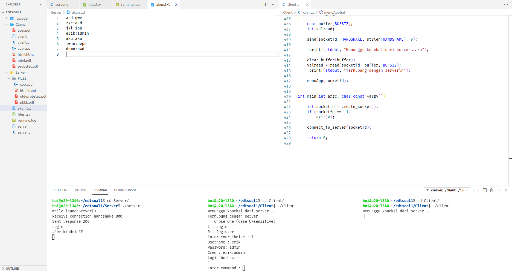
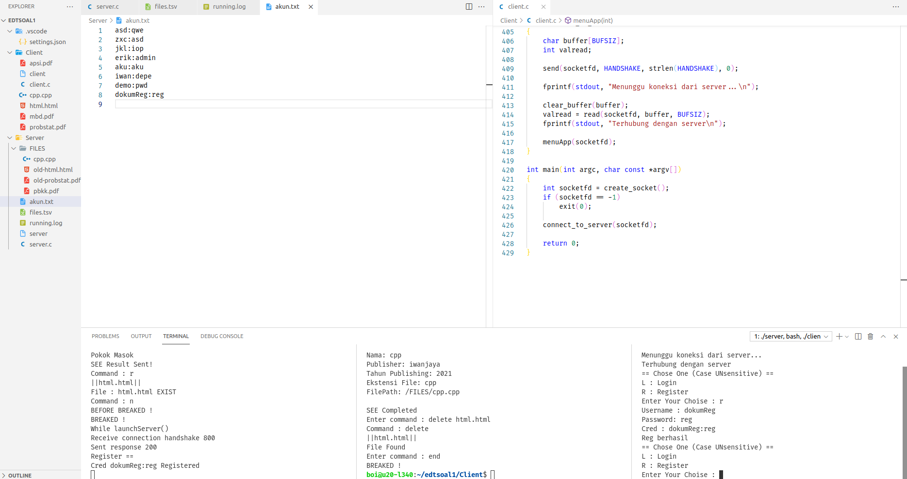

# Laporan Penjelasan Soal Shift Modul 3

## Anggota

- Mohammad Faderik Izzul Haq (05111940000023)
- Jonathan Timothy Siregar (05111940000120)
- Abiya Sabitta Ragadani (05111940000166)

## SOAL 1
Pada soal ini, diminta untuk menangani program server-client dengan socket programming dan thread.

A. Pada saat client tersambung dengan server, terdapat dua pilihan pertama, yaitu register dan login. Jika memilih register, client akan diminta input id dan passwordnya untuk dikirimkan ke server. User juga dapat melakukan login. Login berhasil jika id dan password yang dikirim dari aplikasi client sesuai dengan list akun yang ada didalam aplikasi server. Sistem ini juga dapat menerima multi-connections. Koneksi terhitung ketika aplikasi client tersambung dengan server. Jika terdapat 2 koneksi atau lebih maka harus menunggu sampai client pertama keluar untuk bisa melakukan login dan mengakses aplikasinya. Keverk menginginkan lokasi penyimpanan id dan password pada file bernama akun.txt dengan format : `id:password`
<p align="center">
  
</p>
<p align="center">
  
</p>

#### Client
- User diminta memasukan credential : id dan password, lalu digabungkan menjadi string sesuai dengan format, kemudian client mengirim string tersebut ke server.
```c
int logIn(int sock)
{
    ...
    printf("Username : ");
    scanf("%s", uname);
    printf("Password: ");
    scanf("%s", pwd);
    sprintf(cred, "%s:%s", uname, pwd);
    printf("Cred : %s\n", cred);

    send(sock, cred, sizeof(cred), 0);
    int valread = read(sock, buffer, sizeof(buffer));

    if (buffer[0] == 1 + '0')
    {
        printf("Login berhasil\n");
        return 1;
    }
    else
    {
        printf("Login gagal\n");
        return 0;
    }
}

void reg(int sock)
{
    ...
    printf("Username : ");
    scanf("%s", uname);
    printf("Password: ");
    scanf("%s", pwd);
    sprintf(cred, "%s:%s", uname, pwd);
    printf("Cred : %s\n", cred);

    send(sock, cred, sizeof(cred), 0);
    int valread = read(sock, buffer, sizeof(buffer));

    if (buffer[0] == 1 + '0')
    {
        printf("Reg berhasil\n");
    }
    else
    {
        printf("Reg gagal\n");
    }
}
```
#### Server
- Pada server perlu inisialisasi server dan membuat thread untuk dapat menghandle multi-connection
- Fungsi `handle_new_connection()` digunakan untuk menghandle aplikasi utama untuk setiap koneksi baru yang terhubunf ke server
```c
void launchServer()
{
    ...
    pthread_t tid[100];
    int connections = 0;

    // inisialisasi server socket

    while (1)
    {
        printf("While launchServer()\n");
        if ((socketfd = accept(server_fd, (struct sockaddr *)&address, (socklen_t *)&addrlen)) < 0)
        {
            perror("accept failed");
            exit(EXIT_FAILURE);
        }

        pthread_create(&(tid[connections]), NULL, &handle_new_connection, &socketfd);
        pthread_join(tid[connections], NULL);
        connections++;
    }
}

void *handle_new_connection(void *arg)
{
    char buffer[BUFSIZ];
    int valread;
    int socketfd = *(int *)arg;

    clear_buffer(buffer);
    valread = read(socketfd, buffer, BUFSIZ);
    fprintf(stdout, "Receive connection handshake %s\n", buffer);

    send(socketfd, SUCCESS, strlen(SUCCESS), 0);
    fprintf(stdout, "Sent response %s\n", SUCCESS);

    mainApp(socketfd);
}
```
- Fungsi `login()` akan menerima credential dari client dan mengecek kevalidan data `id:pwd` dengan yang telah terdaftar di `akun.txt` , jika berhasil credential direturn sebagai string ke mainApp untuk disimpan
- Fungsi `reg()` digunakan untuk menghadle register dari client, server menyimpan string yang diterima dari client `id:pwd` ke file `akun.txt`
```c
int reg(int socketfd)
{
    FILE *fp;
    fp = fopen("akun.txt", "a+");
    ...
    while (fscanf(fp, "%s", cred) != EOF)
    {
        if (!strcmp(cred, buffer))
        {
            printf("Cred : %s Already exist\n", cred);
            isReg = 0;
            break;
        }
    }
    if (isReg != 0)
    {
        fprintf(fp, "%s\n", buffer);
        printf("Cred %s Registered\n", buffer);
        isReg = 1;
    }

    sprintf(sent, "%d", isReg);
    send(socketfd, sent, BUFSIZ, 0);

    fclose(fp);
    return isReg;
}

char *logIn(int sock)
{
    FILE *fp = fopen("akun.txt", "r");
    ...
    int isLogin = 0;

    memset(buffer, 0, sizeof(buffer));
    int valread = read(sock, buffer, BUFSIZ);

    while (fscanf(fp, "%s", cred) != EOF)
    {
        if (!strcmp(cred, buffer))
        {
            isLogin = 1;
            break;
        }
        else
        {
            for (q = 0; q < 100; q++)
                cred[q] = '\0';
        }
    }

    sprintf(sent, "%d", isLogin);
    send(sock, sent, sizeof(sent), 0);

    return cred;
}
```
## B
Sistem memiliki sebuah database yang bernama files.tsv. Isi dari files.tsv ini adalah path file saat berada di server, publisher, dan tahun publikasi. Setiap penambahan dan penghapusan file pada folder file yang bernama  FILES pada server akan memengaruhi isi dari files.tsv. Folder FILES otomatis dibuat saat server dijalankan.
```c
mkdir('FILES', 0777)
```
pembuatan file `files.tsv` dan penjelasan lebih lengkap ada pada sub soal selanjutnya
## C
Program diminta membuat fitur agar client dapat menambah file baru ke dalam server. Pertama client mengirimkan input ke server dengan perintah `add`. Kemudian, dari aplikasi client akan dimasukan data buku tersebut (perlu diingat bahwa Filepath ini merupakan path file yang akan dikirim ke server). Lalu client nanti akan melakukan pengiriman file ke aplikasi server dengan menggunakan socket. Ketika file diterima di server, maka row dari files.tsv akan bertambah sesuai dengan data terbaru yang ditambahkan.
### Client
- pada Fungsi utama program menerima input command dari user dan mencocokan dengan comman yang ada.
```c
printf("Enter command : ");
scanf(" %[^\n]c", cmd);
```

- Jika command yang dimasukan user adalah `add` maka program akan meminta input data buku, lalu mengirim data tersebut ke server. Setelah itu client menjalankan fungsi `uploadFile()` untuk mengirim file terkait ke server.
```c
...
if (!strcmp(cmd, "add"))
{
    printf("Command : add\n");
    send(sock, "a", BUFSIZ, 0);
    char temp[100];
    printf("Publisher: ");
    scanf("%s", pub);
    strcpy(temp, pub);
    printf("Tahun Publikasi: ");
    scanf("%s", thn);
    printf("Filepath: ");
    scanf("%s", filePth);
    sprintf(pkt, "%s\t%s\t%s", filePth, temp, thn);
    printf("||%s||\n", pkt);
    send(sock, pkt, sizeof(pkt), 0);
    uplodFile(sock, filePth);
    valread = read(sock, buffer, BUFSIZ);
    if (buffer[0] == 's')
    {
        printf("Data received by server ############################\n");
    }
    else
    {
        printf("error\n");
    }
}
```
- Fungsi `uploadFile()` secara garis besar mengambil character dalam file dari awal hingga ahir dan menyimpannya dalam sebuah string untuk dikirim ke server melalui socket.
```c
void uplodFile(int sock, char filePth[])
{
    ...
    fd = open(filePth, O_RDONLY);
    if (fstat(fd, &file_stat) < 0)
        printf("errorrr");
    ...
    remData = file_stat.st_size;
    offset = 0;
    /* Sending file data */
    while (((sentBytes = sendfile(sock, fd, &offset, BUFSIZ)) > 0) && (remData > 0))
    {
        remData -= sentBytes;
    }
    close(fd);
}
```
### Server
- Porgram membaca string yang dikirim oleh client dan memcocokan dengan command yang tersedia
```c
read(new_socket, cmd, BUFSIZ);
printf("Command : %s\n", cmd);
```

- Jika command yang diterima adalah `add` pogram harus membaca data yang dikirimkan oleh client dan disimpan di `files.tsv` sesuai format yang ada.
```c
...
if (strstr(cmd, "a"))
{
    ...
    valread = read(new_socket, buffer, BUFSIZ);
    buf[i] = strtok(buffer, "\t");
    while (buf[i] != NULL)
    {
        buf[++i] = strtok(NULL, "\t");
    }
    downFile(new_socket, buf[0]);
    FILE *fp;
    fp = fopen("files.tsv", "a+");
    fprintf(fp, "%s\t%s\t%s\n", buf[0], buf[1], buf[2]);
    send(new_socket, "s", BUFSIZ, 0);
    fclose(fp);
    ...
}
```
- Setelah client mengirim file dengan fungsi `uploadFile()`. Pada sisi server, server menjalankan fungsi `downFile()` yang berfungsi untuk menerima file yang dikirimkan oleh client. Dimana fungsi ini membuat file baru dengan nama sesuai namafile yang dikirm client, dan mengisinya dengan data file yang juga dikirim oleh client.
```c
void downFile(int sock, char fileName[])
{
    ...
    recv(sock, bufFile, BUFSIZ, 0);
    fileSize = atoi(bufFile);
    fprintf(stdout, "File size : %d\n", fileSize);
    sprintf(filePth, "FILES/%s", fileName);
    printf("FILE PATH : %s\n", filePth);
    rcvdFile = fopen(filePth, "w");
    if (rcvdFile == NULL)
    {
        printf("Failed to open file\n");
        exit(EXIT_FAILURE);
    }
    remData = fileSize;
    while ((remData > 0) && ((len = recv(sock, bufFile, BUFSIZ, 0)) > 0))
    {
        fwrite(bufFile, sizeof(char), len, rcvdFile);
        remData -= len;
    }
    fclose(rcvdFile);
}
```


## Soal 2

### Sub Soal A

Pada soal ini, kita diminta untuk melakukan suatu operasi pada dua buah matrix, yakni matrixA 4 * 3 dan matrixB 3 * 6. Kedua matrix tersebut akan dimasukkan menggunakan fungsi `scanf`, kemudian dilakukan perkalian kedua matrix tersebut dan terakhir akan dilakukan penyimpanan matrixHasil untuk selanjutnya digunakan pada [soal2a](soal2/soal2a.c).
