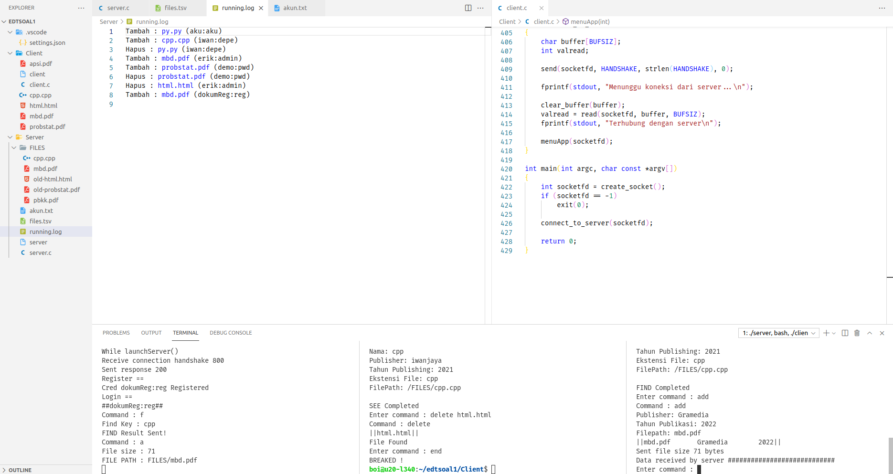
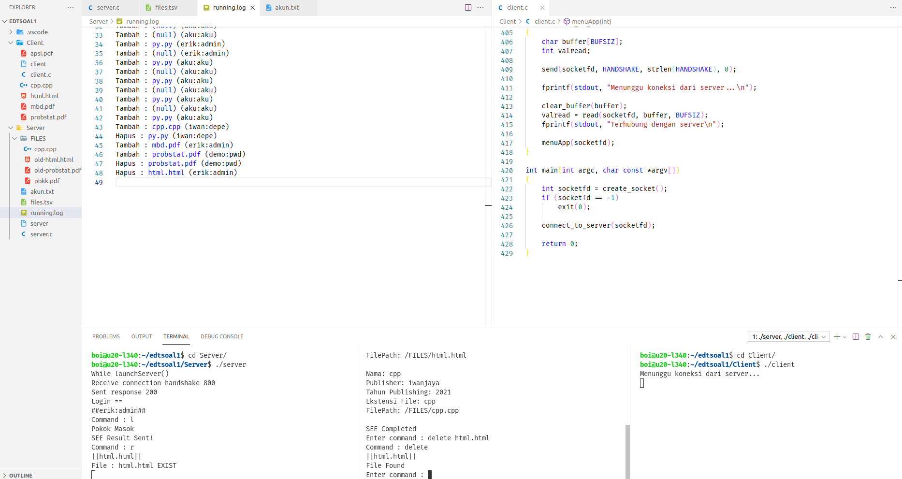
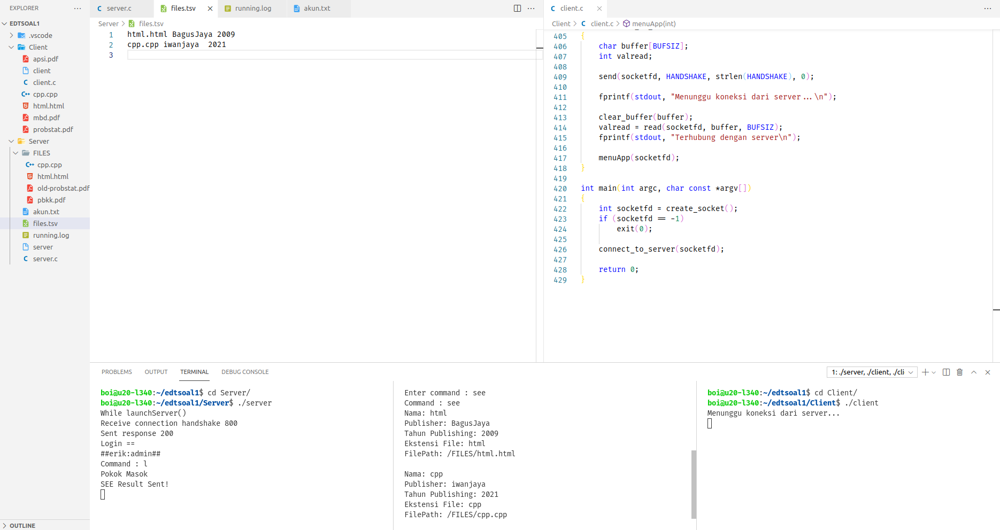
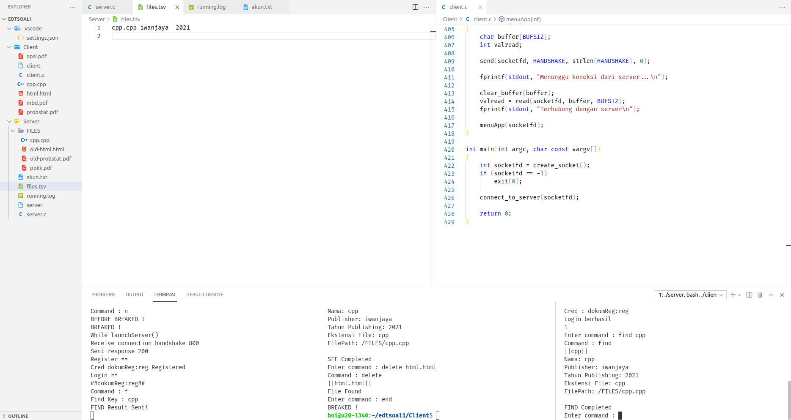

# Laporan Penjelasan Soal Shift Modul 3

## Anggota

- Mohammad Faderik Izzul Haq (05111940000023)
- Jonathan Timothy Siregar (05111940000120)
- Abiya Sabitta Ragadani (05111940000166)

## SOAL 1

Pada soal ini, diminta untuk menangani program server-client dengan socket programming dan thread.

## A

Pada saat client tersambung dengan server, terdapat dua pilihan pertama, yaitu register dan login. Jika memilih register, client akan diminta input id dan passwordnya untuk dikirimkan ke server. User juga dapat melakukan login. Login berhasil jika id dan password yang dikirim dari aplikasi client sesuai dengan list akun yang ada didalam aplikasi server. Sistem ini juga dapat menerima multi-connections. Koneksi terhitung ketika aplikasi client tersambung dengan server. Jika terdapat 2 koneksi atau lebih maka harus menunggu sampai client pertama keluar untuk bisa melakukan login dan mengakses aplikasinya. Keverk menginginkan lokasi penyimpanan id dan password pada file bernama akun.txt dengan format : `id:password`

<p align="center">
  
</p>
<p align="center">
  
</p>

### Client

- User diminta memasukan credential : id dan password, lalu digabungkan menjadi string sesuai dengan format, kemudian client mengirim string tersebut ke server.

```c
int logIn(int sock)
{
    ...
    printf("Username : ");
    scanf("%s", uname);
    printf("Password: ");
    scanf("%s", pwd);
    sprintf(cred, "%s:%s", uname, pwd);
    printf("Cred : %s\n", cred);

    send(sock, cred, sizeof(cred), 0);
    int valread = read(sock, buffer, sizeof(buffer));

    if (buffer[0] == 1 + '0')
    {
        printf("Login berhasil\n");
        return 1;
    }
    else
    {
        printf("Login gagal\n");
        return 0;
    }
}

void reg(int sock)
{
    ...
    printf("Username : ");
    scanf("%s", uname);
    printf("Password: ");
    scanf("%s", pwd);
    sprintf(cred, "%s:%s", uname, pwd);
    printf("Cred : %s\n", cred);

    send(sock, cred, sizeof(cred), 0);
    int valread = read(sock, buffer, sizeof(buffer));

    if (buffer[0] == 1 + '0')
    {
        printf("Reg berhasil\n");
    }
    else
    {
        printf("Reg gagal\n");
    }
}
```

- Selain itu program client dapat mengatasi command `end` yang berfungsi untuk mengakhiri koneksi client dengan server. program hanya perlu melakukan `break` terhadap program utama, Sehingga program berhenti dan server dapat terhubung ke client lain.

```c
...
else if (strstr(cmd, "end") != NULL)
{
    send(sock, "n", BUFSIZ, 0);
    break;
}
```

### Server

- Pada server perlu inisialisasi server dan membuat thread untuk dapat menghandle multi-connection
- Fungsi `handle_new_connection()` digunakan untuk menghandle aplikasi utama untuk setiap koneksi baru yang terhubunf ke server

```c
void launchServer()
{
    ...
    pthread_t tid[100];
    int connections = 0;

    // inisialisasi server socket

    while (1)
    {
        printf("While launchServer()\n");
        if ((socketfd = accept(server_fd, (struct sockaddr *)&address, (socklen_t *)&addrlen)) < 0)
        {
            perror("accept failed");
            exit(EXIT_FAILURE);
        }

        pthread_create(&(tid[connections]), NULL, &handle_new_connection, &socketfd);
        pthread_join(tid[connections], NULL);
        connections++;
    }
}

void *handle_new_connection(void *arg)
{
    char buffer[BUFSIZ];
    int valread;
    int socketfd = *(int *)arg;

    clear_buffer(buffer);
    valread = read(socketfd, buffer, BUFSIZ);
    fprintf(stdout, "Receive connection handshake %s\n", buffer);

    send(socketfd, SUCCESS, strlen(SUCCESS), 0);
    fprintf(stdout, "Sent response %s\n", SUCCESS);

    mainApp(socketfd);
}
```

- Fungsi `login()` akan menerima credential dari client dan mengecek kevalidan data `id:pwd` dengan yang telah terdaftar di `akun.txt` , jika berhasil credential direturn sebagai string ke mainApp untuk disimpan
- Fungsi `reg()` digunakan untuk menghadle register dari client, server menyimpan string yang diterima dari client `id:pwd` ke file `akun.txt`

```c
int reg(int socketfd)
{
    FILE *fp;
    fp = fopen("akun.txt", "a+");
    ...
    while (fscanf(fp, "%s", cred) != EOF)
    {
        if (!strcmp(cred, buffer))
        {
            printf("Cred : %s Already exist\n", cred);
            isReg = 0;
            break;
        }
    }
    if (isReg != 0)
    {
        fprintf(fp, "%s\n", buffer);
        printf("Cred %s Registered\n", buffer);
        isReg = 1;
    }

    sprintf(sent, "%d", isReg);
    send(socketfd, sent, BUFSIZ, 0);

    fclose(fp);
    return isReg;
}

char *logIn(int sock)
{
    FILE *fp = fopen("akun.txt", "r");
    ...
    int isLogin = 0;

    memset(buffer, 0, sizeof(buffer));
    int valread = read(sock, buffer, BUFSIZ);

    while (fscanf(fp, "%s", cred) != EOF)
    {
        if (!strcmp(cred, buffer))
        {
            isLogin = 1;
            break;
        }
        else
        {
            for (q = 0; q < 100; q++)
                cred[q] = '\0';
        }
    }

    sprintf(sent, "%d", isLogin);
    send(sock, sent, sizeof(sent), 0);

    return cred;
}
```

- Server juga dapat mengatassi command `end` untuk mengakhiri koneksi client dengan server, supaya client lain bisa terhubung dengan server. Pada saat command `end` dideteksi server akan melakukan `break` supaya program keluar dari while program utama dan kembali ke while pada fungsi `launch_server()` untuk membuat thread baru yang akan mengatasi koneksi baru dengan client baru.

```c
...
else if (strstr(cmd, "n") != NULL)
{
    sleep(2);
    break;
}

```

## B

Sistem memiliki sebuah database yang bernama files.tsv. Isi dari files.tsv ini adalah path file saat berada di server, publisher, dan tahun publikasi. Setiap penambahan dan penghapusan file pada folder file yang bernama FILES pada server akan memengaruhi isi dari files.tsv. Folder FILES otomatis dibuat saat server dijalankan.

```c
mkdir('FILES', 0777)
```

pembuatan file `files.tsv` dan penjelasan lebih lengkap ada pada sub soal selanjutnya

## C

Program diminta membuat fitur agar client dapat menambah file baru ke dalam server. Pertama client mengirimkan input ke server dengan perintah `add`. Kemudian, dari aplikasi client akan dimasukan data buku tersebut (perlu diingat bahwa Filepath ini merupakan path file yang akan dikirim ke server). Lalu client nanti akan melakukan pengiriman file ke aplikasi server dengan menggunakan socket. Ketika file diterima di server, maka row dari files.tsv akan bertambah sesuai dengan data terbaru yang ditambahkan.

<p align="center">
  
</p>

### Client

- pada Fungsi utama program menerima input command dari user dan mencocokan dengan comman yang ada.

```c
printf("Enter command : ");
scanf(" %[^\n]c", cmd);
```

- Jika command yang dimasukan user adalah `add` maka program akan meminta input data buku, lalu mengirim data tersebut ke server. Setelah itu client menjalankan fungsi `uploadFile()` untuk mengirim file terkait ke server.

```c
...
if (!strcmp(cmd, "add"))
{
    printf("Command : add\n");
    send(sock, "a", BUFSIZ, 0);
    char temp[100];
    printf("Publisher: ");
    scanf("%s", pub);
    strcpy(temp, pub);
    printf("Tahun Publikasi: ");
    scanf("%s", thn);
    printf("Filepath: ");
    scanf("%s", filePth);
    sprintf(pkt, "%s\t%s\t%s", filePth, temp, thn);
    printf("||%s||\n", pkt);
    send(sock, pkt, sizeof(pkt), 0);
    uplodFile(sock, filePth);
    valread = read(sock, buffer, BUFSIZ);
    if (buffer[0] == 's')
    {
        printf("Data received by server ############################\n");
    }
    else
    {
        printf("error\n");
    }
}
```

- Fungsi `uploadFile()` secara garis besar mengambil character dalam file dari awal hingga ahir dan menyimpannya dalam sebuah string untuk dikirim ke server melalui socket.

```c
void uplodFile(int sock, char filePth[])
{
    ...
    fd = open(filePth, O_RDONLY);
    if (fstat(fd, &file_stat) < 0)
        printf("errorrr");
    ...
    remData = file_stat.st_size;
    offset = 0;
    /* Sending file data */
    while (((sentBytes = sendfile(sock, fd, &offset, BUFSIZ)) > 0) && (remData > 0))
    {
        remData -= sentBytes;
    }
    close(fd);
}
```

### Server

- Porgram membaca string yang dikirim oleh client dan memcocokan dengan command yang tersedia

```c
read(new_socket, cmd, BUFSIZ);
printf("Command : %s\n", cmd);
```

- Jika command yang diterima adalah `add` pogram harus membaca data yang dikirimkan oleh client dan disimpan di `files.tsv` sesuai format yang ada.

```c
...
if (strstr(cmd, "a"))
{
    ...
    valread = read(new_socket, buffer, BUFSIZ);
    buf[i] = strtok(buffer, "\t");
    while (buf[i] != NULL)
    {
        buf[++i] = strtok(NULL, "\t");
    }
    downFile(new_socket, buf[0]);
    FILE *fp;
    fp = fopen("files.tsv", "a+");
    fprintf(fp, "%s\t%s\t%s\n", buf[0], buf[1], buf[2]);
    send(new_socket, "s", BUFSIZ, 0);
    fclose(fp);
    ...
}
```

- Setelah client mengirim file dengan fungsi `uploadFile()`. Pada sisi server, server menjalankan fungsi `downFile()` yang berfungsi untuk menerima file yang dikirimkan oleh client. Dimana fungsi ini membuat file baru dengan nama sesuai namafile yang dikirm client, dan mengisinya dengan data file yang juga dikirim oleh client.

```c
void downFile(int sock, char fileName[])
{
    ...
    recv(sock, bufFile, BUFSIZ, 0);
    fileSize = atoi(bufFile);
    fprintf(stdout, "File size : %d\n", fileSize);
    sprintf(filePth, "FILES/%s", fileName);
    printf("FILE PATH : %s\n", filePth);
    rcvdFile = fopen(filePth, "w");
    if (rcvdFile == NULL)
    {
        printf("Failed to open file\n");
        exit(EXIT_FAILURE);
    }
    remData = fileSize;
    while ((remData > 0) && ((len = recv(sock, bufFile, BUFSIZ, 0)) > 0))
    {
        fwrite(bufFile, sizeof(char), len, rcvdFile);
        remData -= len;
    }
    fclose(rcvdFile);
}
```

## D

Client dapat mendownload file yang telah ada dalam folder FILES di server, sehingga sistem harus dapat mengirim file ke client. Server harus melihat dari files.tsv untuk melakukan pengecekan apakah file tersebut valid. Jika tidak valid, maka mengirimkan pesan error balik ke client. Jika berhasil, file akan dikirim dan akan diterima ke client di folder client tersebut. contoh : `download filename.pdf`

### Client

- Client mengecek apabila command mengandung 'download' maka client akan mengirim namafile ke server. Jika server menemukan file tersebut, client akan menjalankan fungsi `downFile()` yang berfungsi untuk menerima file dari server.

```c
...
else if (strstr(cmd, "download") != NULL)
{
    printf("Command : download\n");
    send(sock, "d", BUFSIZ, 0);

    char *buf[2];
    int i = 0;
    buf[i] = strtok(cmd, " ");
    while (buf[i] != NULL)
    {
        buf[++i] = strtok(NULL, " ");
    }
    sprintf(pkt, "%s", buf[1]);
    printf("||%s||\n", pkt);
    send(sock, pkt, sizeof(pkt), 0);
    valread = read(sock, buffer, BUFSIZ);
    if (buffer[0] == 's')
    {
        printf("File Found\n");
        downFile(sock, buf[1]);
    }
    else
    {
        printf("FILE NOT FOUND\n");
    }
}
```

- Fungsi `downFile()` sama dengan `downFile()` yang ada pada sisi server di subsoal sebelumnya.

### Server

- Sedangkan pada server, setelah menerima `namafile` yang dikirimkan client. Server mengecek apakah `namaFile` tersebut ada pada direktori server, jika ada, jalankan fungsi `uploadFile()` yang berfungsi untuk mengirim file ke client.

```c
...
else if (strstr(cmd, "d"))
{
    valread = read(new_socket, buffer, BUFSIZ);

    printf("||%s||\n", buffer);
    char filePth[BUFSIZ + 100];
    sprintf(filePth, "FILES/%s", buffer);
    if (checkFile(buffer))
    {
        send(new_socket, "s", BUFSIZ, 0);
        uplodFile(new_socket, filePth);
    }
    else
    {
        send(new_socket, "x", BUFSIZ, 0);
        continue;
    }
}
```

- Fungsi `uploadFile()` sama dengan `uploadFile()` yang ada pada sisi client di subsoal sebelumnya

## E

Client juga dapat menghapus file yang tersimpan di server. Akan tetapi, File hanya akan diganti namanya menjadi ‘old-NamaFile.ekstensi’. Ketika file telah diubah namanya, maka row dari file tersebut di file.tsv akan terhapus. contoh `delete namaFile.pdf`

<p align="center">
  
</p>

### Client

- Pada sisi client, hanya mengecek jika command mengandung 'delete' maka kirim `namaFile` ke server

```c
...
else if (strstr(cmd, "delete") != NULL)
{
    printf("Command : delete\n");
    send(sock, "r", BUFSIZ, 0);

    char *buf[2];
    int i = 0;
    buf[i] = strtok(cmd, " ");
    while (buf[i] != NULL)
    {
        buf[++i] = strtok(NULL, " ");
    }

    sprintf(pkt, "%s", buf[1]);
    printf("||%s||\n", pkt);
    send(sock, pkt, sizeof(pkt), 0);

    valread = read(sock, buffer, BUFSIZ);
    if (buffer[0] == 's')
    {
        printf("File Found\n");
    }
    else
    {
        printf("FILE NOT FOUND\n");
    }
}
```

### Server

- Pada sisi server, jika command berupa `delete` maka program akan menerima `namaFile` dari server lalu mengecek apakah `namaFile` tersebut ada pada server. Jika ada, jalankan fungsi `deleteFile()`.

```c
else if (strstr(cmd, "r"))
{
    valread = read(new_socket, buffer, BUFSIZ);

    printf("||%s||\n", buffer);
    char filePth[BUFSIZ + 100];
    sprintf(filePth, "FILES/%s", buffer);
    if (checkFile(buffer))
    {
        send(new_socket, "s", BUFSIZ, 0);
        deleteFile(buffer);
        FILE *flog = fopen("running.log", "a");
        fprintf(flog, "Hapus : %s (%s)\n", buffer, cred);
        fclose(flog);
    }
    else
    {
        send(new_socket, "x", BUFSIZ, 0);
        continue;
    }
}
```

- Fungsi `deleteFile()` ini akan mencari `namaFile` yang diperoleh dari client pada `files.tsv`, jika baris yang mengandung `namaFile` tersebut telah ditemukan, hapus baris tersebut dengan fungsi `deleteLine()`. Setelah baris tersebut dihapus, ganti nama file dari `namaFile` menjadi `old-namaFile` dengan fungsi `rename()`.

```c
int deleteFile(char fileName[])
{
    char line[256];

    FILE *fp = fopen("files.tsv", "r");
    int cLine = 0;

    while (fgets(line, sizeof line, fp))
    {
        cLine++;
        if (strstr(line, fileName) != NULL)
        {
            char filePth[BUFSIZ + 100];
            sprintf(filePth, "FILES/%s", fileName);

            char rmvFilePth[100];
            sprintf(rmvFilePth, "FILES/old-%s", fileName);

            deleteLine(cLine);

            rename(filePth, rmvFilePth);
            break;
        }
    }

    fclose(fp);
}
```

- Fungsi `deleteLine() ini akan menyalin semua line yang ada diatas dan dibawah baris yang akan dihapus ke file baru. Setelah itu, file lama ynag mengandung baris yang akan dihapus, dihapus.

```c
void deleteLine(int line_number)
{
    FILE *fp, *fpTemp;
    char ss[BUFSIZ];
    int counter = 0;
    char ch;

    fp = fopen("files.tsv", "r");
    fpTemp = fopen("filesTemp.tsv", "w");

    while (!feof(fp))
    {
        strcpy(ss, "\0");
        fgets(ss, BUFSIZ, fp);
        if (!feof(fp))
        {
            counter++;
            if (counter != line_number)
            {
                fprintf(fpTemp, "%s", ss);
            }
        }
    }
    fclose(fp);
    fclose(fpTemp);
    remove("files.tsv");
    rename("filesTemp.tsv", "files.tsv");
}
```

## F

Client dapat melihat semua isi files.tsv dengan memanggil suatu perintah yang bernama see. Output dari perintah tersebut keluar dengan format yang ada.

<p align="center">
  
</p>

### Clinet

- Client hanya mencocokan command yang dimasukan user, jika command berupa `see` maka kirim comman tersebut ke server. Setelah memperoleh hasil `see` yang telah diolah oleh server, client tinggal menampilkan kepada user.

```c
else if (!strcmp(cmd, "see"))
{
    printf("Command : see\n");
    send(sock, "l", BUFSIZ, 0);

    read(sock, buffer, BUFSIZ);
    printf("%s", buffer);
    clear_buffer(buffer);

    valread = read(sock, buffer, BUFSIZ);
    if (buffer[0] == 's')
    {
        printf("SEE Completed\n");
    }
    else
    {
        printf("error seeing serever\n");
    }
}
```

### Server

- Pada sisi server, jika command yang diterima berupa `see`, program menjalankan fungsi `see()`

```c
else if (strstr(cmd, "l") != NULL)
{
    if (see(new_socket))
    {
        printf("SEE Result Sent!\n");
        send(new_socket, "s", BUFSIZ, 0);
    }
    else
    {
        send(new_socket, "x", BUFSIZ, 0);
        continue;
    }
}
```

- Pada fungsi ini, program mengiterasi semua line yang ada pada `files.tsv` kemudian disususn menjadi sesuai format yang ada. lalu hasil dari string yang telah disusun tersebut dikirim ke client melalui socket.

```c
int see(int sock)
{
    char line[256], temp[256];
    char *buf[4];
    char *file[2];

    // char temp[256];
    // char *sent = malloc(sizeof(char) * BUFSIZ);
    char sent[BUFSIZ];
    clear_buffer(sent);

    FILE *fp = fopen("files.tsv", "r");
    if (fp == NULL)
    {
        printf("Failed to open file\n");
        exit(EXIT_FAILURE);
    }
    char nama[20], pub[20], thn[20], eks[20], pth[20];

    while (fgets(line, sizeof line, fp))
    {
        int i = 0;
        buf[i] = strtok(line, "\t");
        while (buf[i] != NULL)
        {
            buf[++i] = strtok(NULL, "\t");
        }

        int j = 0;
        file[j] = strtok(buf[0], ".");
        while (file[j] != NULL)
        {
            file[++j] = strtok(NULL, ".");
        }

        strcpy(nama, file[0]);
        strcpy(eks, file[1]);
        strcpy(pub, buf[1]);

        strcpy(thn, buf[2]);
        int idx = strlen(thn) - 1;
        memmove(&thn[idx], &thn[idx + 1], strlen(thn) - (idx));

        sprintf(pth, "/FILES/%s.%s", file[0], file[1]);

        sprintf(
            temp,
            "Nama: %s\nPublisher: %s\nTahun Publishing: %s\nEkstensi File: %s\nFilePath: %s\n\n",
            nama, pub, thn, eks, pth);

        strcat(sent, temp);
    }

    fclose(fp);
    send(sock, sent, BUFSIZ, 0);

    return 1;
}

```

## G

Aplikasi client juga dapat melakukan pencarian dengan memberikan suatu string. Hasilnya adalah semua nama file yang mengandung string tersebut. Format output seperti format output f.

<p align="center">
  
</p>

### Client

- Pada sisi client program akan mengecek command yang dimasukan user, jika mengandung 'find' client akan mengirimkan kata kunci yang dimasukan user ke server. Setelah kata kunci dikirim, client menungggu kiriman hasil operasi find di server. jika sudah memperoleh kiriman string dari server, client bisa menampilkan data tersebut ke user

```c
else if (strstr(cmd, "find") != NULL)
{
    printf("Command : find\n");
    send(sock, "f", BUFSIZ, 0);

    char *buf[2];
    int i = 0;
    buf[i] = strtok(cmd, " ");
    while (buf[i] != NULL)
    {
        buf[++i] = strtok(NULL, " ");
    }

    sprintf(pkt, "%s", buf[1]);
    printf("||%s||\n", pkt);
    send(sock, pkt, sizeof(pkt), 0);

    read(sock, buffer, BUFSIZ);
    printf("%s", buffer);
    clear_buffer(buffer);

    valread = read(sock, buffer, BUFSIZ);
    if (buffer[0] == 's')
    {
        printf("FIND Completed\n");
    }
    else
    {
        printf("error seeing serever\n");
    }
}
```

### Server

- Pada sisi server, secara umum mirip dengan command `see` hanya saja berbeda pada : line yang di kirimkan ke client, hanya line yang memiliki namaFile yang mengandung katakunci yang diberikan

```c
else if (strstr(cmd, "f") != NULL)
{
    read(new_socket, buffer, BUFSIZ);
    printf("Find Key : %s\n", buffer);
    if (find(new_socket, buffer))
    {
        printf("FIND Result Sent!\n");

        send(new_socket, "s", BUFSIZ, 0);
    }
    else
    {
        send(new_socket, "x", BUFSIZ, 0);
        continue;
    }
}
```

## H

Program dapat membuat suatu log untuk server yang bernama running.log

<p align="center">
  
</p>

### Server

- Pada server setelah menjalankan fungsi `deleteFile()` dan `downFile()` program menulis log sesuai format yang ada

```c
downFile()
...
FILE *flog = fopen("running.log", "a");
fprintf(flog, "Tambah : %s (%s)\n", buf[0], cred);
fclose(flog);
```

```c
deleteFile()
...
FILE *flog = fopen("running.log", "a");
fprintf(flog, "Hapus : %s (%s)\n", buffer, cred);
fclose(flog);
```

## Kendala Pengerjaan

1. Soal cukup banyak sehingga memakan waktu
2. Seringkali posisi read dan send yang tidak singkron sehingga data yang diterima bukan data yang seharusnya diterima
3. Sempat bingung dimana letak implementasi thread nya
4. Sering menemui masalah bug/error string pada c yang tidak tau penyebabnya


## Soal 2

### Sub Soal A

Pada soal ini, kita diminta untuk melakukan suatu operasi pada dua buah matrix, yakni matrixA 4 * 3 dan matrixB 3 * 6. Kedua matrix tersebut akan dimasukkan menggunakan fungsi `scanf`, kemudian dilakukan perkalian kedua matrix tersebut dan terakhir akan dilakukan penyimpanan matrixHasil untuk selanjutnya digunakan pada [soal2a](soal2/soal2a.c).

#### Memasukkan 2 buah matrix, matrixA 4 * 3 dan matrixB 3 * 6.

``` cpp
printf("Enter the elements of MatrixA\n");

  for (i = 0 ; i < 4 ; i++ )
    for ( j = 0 ; j < 3 ; j++ )
      scanf("%d", &MatrixA[i][j]);


    printf("Enter the elements of MatrixB\n");

    for ( i = 0 ; i < 3 ; i++ )
      for ( j = 0 ; j < 6 ; j++ )
        scanf("%d", &MatrixB[i][j]);
```

#### Mengoperasikan kedua matrix dengan operasi perkalian

``` cpp
printf("Product of entered Matrix:\n");

    for ( i = 0 ; i < 4 ; i++ )
    {
      for ( j = 0 ; j < 6 ; j++ )
      {
        for ( k = 0 ; k < 3 ; k++ )
        {
          value[i][j] += MatrixA[i][k]*MatrixB[k][j];
        }

        printf("%d\t", value[i][j]);
      }
	printf("\n");
    }
 
 ```

#### Menyimpan hasil perkalian matrix dalam suatu variabel value

``` cpp
    key_t key = 1234;
  	int (*value)[6];

  	int shmid = shmget(key, sizeof(int[4][6]), IPC_CREAT | 0666);
  	value = shmat(shmid, NULL, 0);
    
    shmdt(value);

```


### Sub Soal B

Pada soal ini, kita diminta untuk mengoperasikan matriks hasil perkalian [Sub soal 2a](README.md#sub-soal-a) dengan suatu matrix matrixC yang memiliki ukuran yang sama (4 * 6). Pada sub soal ini, kita kembali diminta memasukkan isi dari matrixC. Nantinya, faktorial dari setiap elemen matrix hasil operasi sub soal sebelumnya akan dilakukan operasi pembagian dengan faktorial dari setiap elemen matrixC. 

#### Memasukkan matrixC

``` cpp
    printf("Enter the elements of MatrixC\n");

    for (i = 0 ; i < 4 ; i++ ){
    	for ( j = 0 ; j < 3 ; j++ ){
      		scanf("%d", &MatrixC[i][j]);
	}
    }
```
    
#### Melakukan pengecekan

``` cpp
    for(i = 0; i < 4; i++){
        for(j = 0; j < 6; j++){
	    nullCheck = false;
            long long *val = malloc(sizeof(long long[4][6]));
            *val = value[i][j];

            subs = value[i][j] - MatrixC[i][j];			// Melakukan pengurangan tiap elemen antar matrix
            if(value[i][j] == 0 || MatrixC[i][j] == 0) 
	    	nullCheck = true;				// Apabila ada elemen yang 0, maka nullCheck bernilai true
```


#### Fungsi-fungsi yang digunakan

##### Faktorial

``` cpp
long long faktorial (int n) {
    if (n <= 1) return 1;				// untuk bilangan 0 atau 1, mengembalikan nilai 1
    else return n * faktorial( n - 1);
}

long long reducer(int n){
	if (n == subs) return 1;
        else return n * reducer(n - 1);
}

void *process(void* arg){
	long long num = *(long long*)arg;
	if(nullCheck)					// Apabila selisih elemen antar matrix = 0 (nullCheck true)
		printf("0 ");				// maka dicetak nilai 0
	else if(subs < 1)				// Apabila selisih elemen antar matrix < 1 
		printf("%lld ", faktorial(num));	// dicetak faktorial bilangan itu sendiri
        else 						// Apabila selisih elemen antar matrix > 1 
		printf("%lld ", reducer(num));		// dicetak reducer bilangan tersebut
}
```

##### Pembuatan thread

``` cpp
    int num;
    key_t key = 1234;
    int (*value)[6];

    int shmid = shmget(key, sizeof(int[4][6]), IPC_CREAT | 0666);
    value = shmat(shmid, NULL, 0);

    pthread_t tid[24];
    
                pthread_create(&tid[m], NULL, &process, val);
            sleep(1);
            m++;
        }
        printf("\n");
    }

    for (i = 0; i < m; i++) {
        pthread_join(tid[i], NULL);
    }

    shmdt(value);
    shmctl(shmid, IPC_RMID, NULL);
    

```


### Sub Soal C

Pada soal ini, kita diminta untuk menggunakan thread dalam mengecek 5 proses teratas dalam program kita. Untuk itu digunakan 3 fungsi yang telah dicantumkan pada soal shift, yakni `ps aux`, `sort -nrk 3,3`, dan `head -5`. Di bawah ini merupakan program nya yang dikombinasikan dengan pipe IPC.

``` cpp
int main() {
  int status;

  int fd1[2];
  int fd2[2];
  pid_t p;

if (pipe(fd1)==-1) { 
	fprintf(stderr, "Pipe Failed" ); 
	return 1; 
	} 
	if (pipe(fd2)==-1) { 
   	 fprintf(stderr, "Pipe Failed" ); 
	 return 1; 
	} 

  p = fork();

  // buat ngefork (ps aux)
  if (p < 0) {
    exit(EXIT_FAILURE);
  }

  else if (p == 0) {

    dup2(fd1[1], STDOUT_FILENO);
    close(fd1[0]);
    close(fd1[1]);

    char *argv[] = {"ps", "aux", NULL};
    execv("/bin/ps", argv);
  } 

    else { //parent

    p = fork();
    if (p < 0) 
      exit(EXIT_FAILURE);
    
    if (p == 0) {
      dup2(fd1[0], STDIN_FILENO);
      dup2(fd2[1], STDOUT_FILENO);
	
      close(fd1[0]);
      close(fd1[1]);
      close(fd2[0]);
      close(fd2[1]);

      char *argv[] = {"sort", "-nrk", "3,3", NULL};
      execv("/usr/bin/sort", argv);
    } 
	
      else {

      dup2(fp2[0], STDIN_FILENO);

      close(fd1[0]);
      close(fd1[1]);
      close(fd2[0]);
      close(fd2[1]);

      char *argv[] = {"head", "-5", NULL};
      execv("/usr/bin/head", argv);
    }
  
}

```
